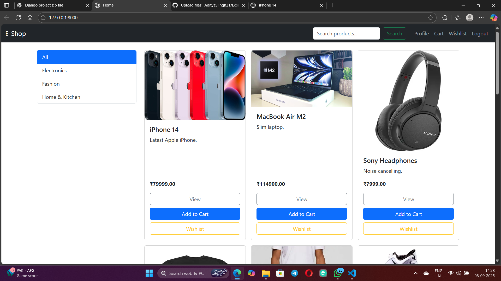
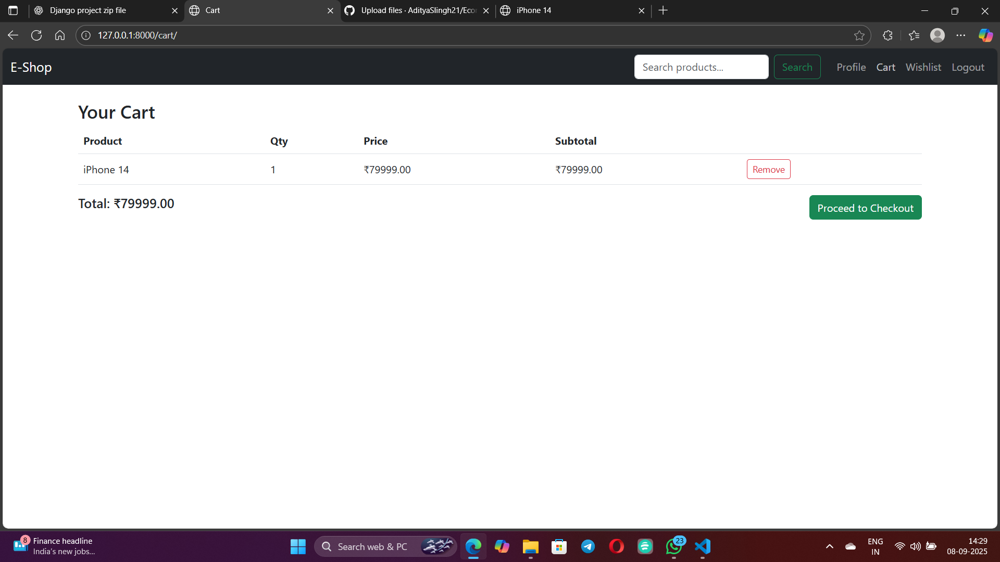
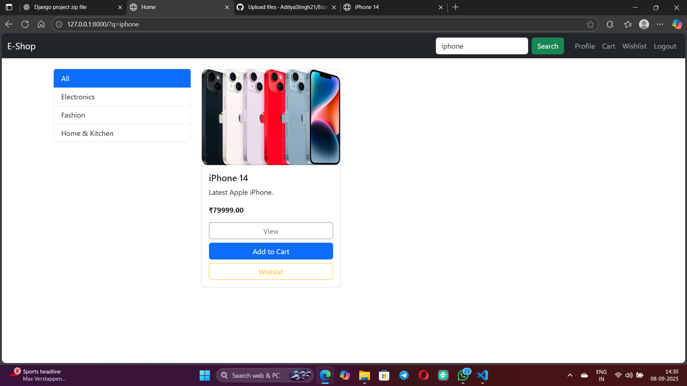

# 🛍️ Ecommerce (Django Project)

A simple **Ecommerce Website** built with **Django**.  
This project includes user authentication, product management, cart, wishlist, and checkout (demo) features.  

---

## ✨ Features
- 🔑 User Authentication (Sign Up, Login, Logout, Profile)
- 📦 Product Categories & Listings
- 🛒 Shopping Cart
- ⭐ Wishlist
- 💳 Checkout (demo order placement)
- 👤 User Profile page
- 📷 Product Images
- ## 📸 Screenshots

### 🏠 Home Page

### 🛒 Cart Page

### ✅ Checkout Page

---

## 🚀 Setup Instructions

1. **Clone the Repository**

   git clone <your-repo-link>
   cd Ecommerce
Create Virtual Environment

python -m venv venv
venv\Scripts\activate   # On Windows
Install Requirements

pip install -r requirements.txt
Apply Migrations

python manage.py migrate
Create Superuser

python manage.py createsuperuser
Run Development Server

python manage.py runserver
Open Website

http://127.0.0.1:8000/

🏠 Home Page

🛒 Cart Page

⭐ Wishlist Page

👤 Profile Page

⚡ Tech Stack
Python 3.x

Django 5.x

SQLite (default DB)

Bootstrap 5

🤝 Contributing
Contributions are welcome!
Feel free to fork the repo, make changes, and create a pull request.
